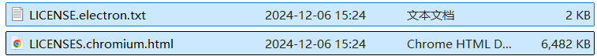
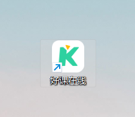
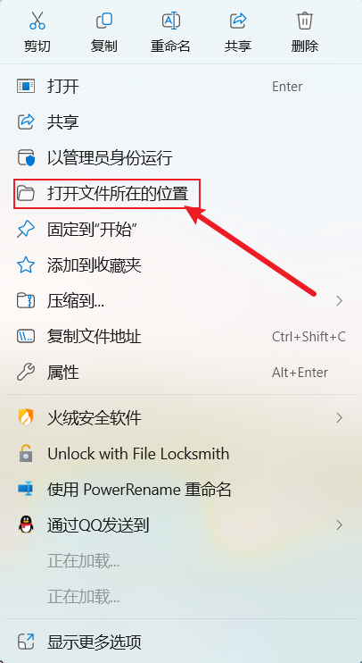
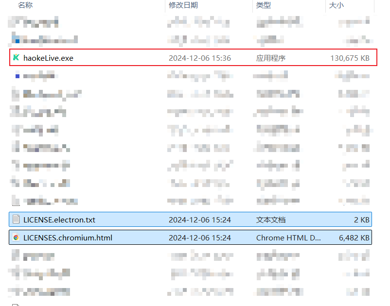
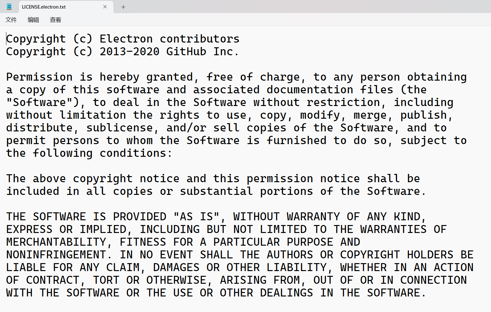
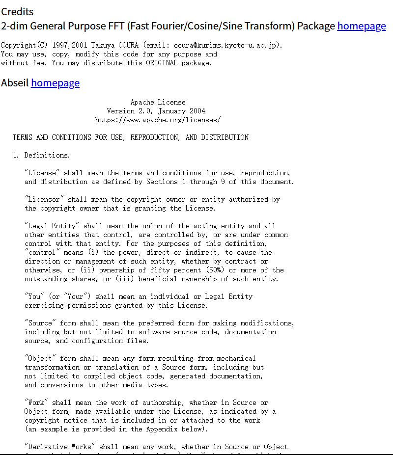

# 手把手带大家“解剖”好课在线APP（电脑版）

> [!WARNING]
>
> 未经本人授权，请勿转载至其他平台！本视频**仅授权给 柠檬耗子**播放！（失效日期：2025年7月5日）

  

## 一、结论

先说结论：

- 好课在线APP电脑版（以下称 好课在线）使用`Electron`框架搭建，用`Chromium`和` Node.js` 作为内核搭建完成（用人话讲就是用写网页的方式做的客户端）

## 二、什么是Electron？

> [!NOTE]
>
> 以下信息内容来源：www.electronjs.org/
>
> 如有问题，请向Electron官方社区反馈！

`Electron`是一个使用 `JavaScript`、`HTML` 和 `CSS` 构建桌面应用程序的框架。 嵌入 `Chromium `和 `Node.js`到 二进制的 `Electron` 允许您保持一个 `JavaScript`代码代码库并创建 在**Windows**上运行的跨平台应用 **macOS**和**Linux**——**不需要**本地开发 经验。(注意看我**加粗**的，那个“**不需要**”是什么意思，懂得都懂！)

## 三、证据

让我们先来看几张图：



看看有没有什么熟悉的东西?

如果眼力好的人，一下子就能看到这几个字：`electron`和`chromium`这几个字，证明了我的我的结论是True的！

### 再来说一下：Electron 和 Chromium 使用的是什么协议

Licence 意为 许可证、协议......

首先说一下，**Electron** 用的是**MIT License (MIT)**

而  **Chromium** 则是用 **BSD License**（注：**BSD License**分类太多，想看请访问：https://book.bsdcn.org/fu-lu-gong-ju-yu-zi-yuan/xukez）

#### MIT License是什么？

**MIT License (MIT)**是一个内容与**三条款BSD许可证**（3-clause BSD license）内容颇为近似，但是赋予软件被授权人更大的权利与更少的限制的许可证

下面我们来看一下所有的开源许可协议都有什么区别吧！


**MIT许可证原文：**

```TEXT
The MIT License (MIT)
Copyright © 2025 <copyright holders>

Permission is hereby granted, free of charge, to any person obtaining a copy of this software and associated documentation files (the “Software”), to deal in the Software without restriction, including without limitation the rights to use, copy, modify, merge, publish, distribute, sublicense, and/or sell copies of the Software, and to permit persons to whom the Software is furnished to do so, subject to the following conditions:

The above copyright notice and this permission notice shall be included in all copies or substantial portions of the Software.

THE SOFTWARE IS PROVIDED “AS IS”, WITHOUT WARRANTY OF ANY KIND, EXPRESS OR IMPLIED, INCLUDING BUT NOT LIMITED TO THE WARRANTIES OF MERCHANTABILITY, FITNESS FOR A PARTICULAR PURPOSE AND NONINFRINGEMENT. IN NO EVENT SHALL THE AUTHORS OR COPYRIGHT HOLDERS BE LIABLE FOR ANY CLAIM, DAMAGES OR OTHER LIABILITY, WHETHER IN AN ACTION OF CONTRACT, TORT OR OTHERWISE, ARISING FROM, OUT OF OR IN CONNECTION WITH THE SOFTWARE OR THE USE OR OTHER DEALINGS IN THE SOFTWARE.
```

被红框框住的就是MIT许可证！请各位自行看一下！


## 四、如何“解剖”好课在线？

首先找到我们的受害者！



**右键它**，点击“**打开文件所在位置**”





在成堆文件当中，可以看到这三个文件特别显眼，用红框框起来的，是受害者的主体，而用蓝色方框框起来的这两个文件就是electron和chromium的许可证，这两个文件不参与程序运行，但是根据开源社区的规定，自己做的程序引用其他开源项目需要将它的许可证保存下来放到文件目录里，我也写过这样子的electron程序，在我git clone和build的时候它会自动把这个许可证clone到本地，执行编译代码的时候，编译器会自动把这两个文件放到文件夹中。

你们可以打开看一下：

内容如下：



chromium内核的许可证内容太多目前只展示一部分，其他人可以自己在文件目录中翻一下，我也会将该文件同时上传至GitHub中，你可以在GitHub中查看这两个文件的原文以及本稿的全部内容，（别忘记给我点个star！）



# 谢谢！

感谢你能翻到这儿！我们会继续努力，创作出更好的内容！

本文如果有任何问题，请发送邮件至 feedback@hatasoft365.top 递交反馈，也可以在GitHub上的Issues中提交反馈，我们会及时解决的！

# 版权

©Copyright 2025 Hatasoft工作室 版权所有
